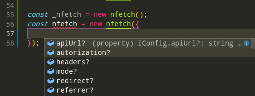

# nFetch
Simplified HTTP request client (< 1kb)

[](https://www.npmjs.com/package/nfetch)
[](https://bundlephobia.com/result?p=nfetch)
[](https://www.npmjs.com/package/nfetch)


## Request method aliases
For convenience aliases have been provided for all supported request methods.

```js
nfetch.get(url, config)
nfetch.delete(url, config)
nfetch.post(url, data, config)
nfetch.put(url, data, config)
```

## Configure API


## Demo
```js
 new nfetch().get('https://jsonplaceholder.typicode.com/todos/1')
    .then(data => console.log(data.data))
    .catch(error => console.log(error));
```
